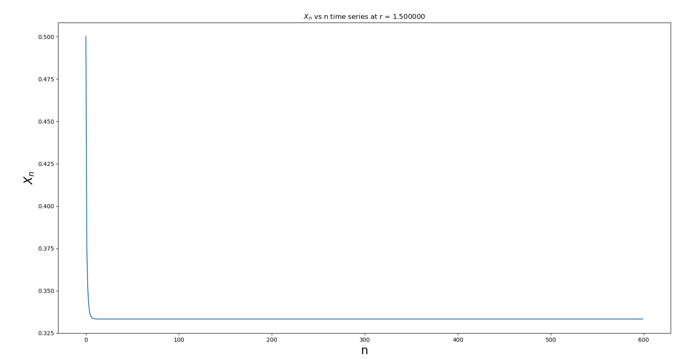
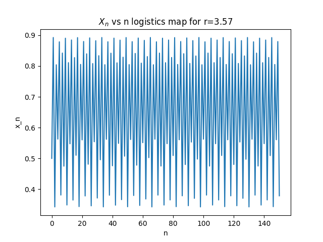

# Non-Linear Systems: Logistic Maps and Chaos

***Suggested Method of Viewing the report***
Since this is a big report, for your convinience please visit this website to see the report clearly
[non-linear-systems-group10](https://logistics-map-group10.netlify.com/)

The logistic map is a model of population growth that exhibits many different types of behavior, dependingon the value of a few constants.
The equation then, for somepopulation $X_n+1$ after an arbitrary time step, starting with population $X_n$ is:

$X_n+1$ = r*$X_n$*(1 - $X_n$)

### Experiment Report by Group 10A 
* Aarushi Goenka IMT2018001
* Abhigna Banda IMT2018002
* Agam Kashyap IMT2018004
* Mohd Nazar Kashif IMT2018042

### References Used
* Explanation of Logistic maps by [Veritasium](https://www.youtube.com/watch?v=ovJcsL7vyrk)
* The Feigenbaum Constant (4.669) - [Numberphile](https://www.youtube.com/watch?v=ETrYE4MdoLQ)

# Time Series Plots 

Code used to generate the time series plots:
```
import numpy as np
import matplotlib.pyplot as plt

def fun(r,x):
    return r*x*(1-x)

r_value = 2.85
init_value = 0.5
max_n = 600
xn_values = []
xn_values.append(init_value)
for i in range(1,max_n):
    xn_values.append(fun(r_value,xn_values[i-1]))

plt.xlabel('n', fontsize=20)
plt.ylabel(r'$X_n$', fontsize=20)
plt.title(r'$X_n$ vs n time series at r = %f'%(r_value))
plt.plot(range(0,max_n),xn_values)
plt.savefig('timeseries%f.png'%(r_value))
plt.show()
```

Corresponding graphs with r values ranging from 1 to 4

***Graph1 (Done by Abhigna)***


***Graph2 (Done by Abhigna)***


***Graph3 (Done by Abhigna)***


***Graph4 (Done by Abhigna)***



***Graph5 (Done by Agam)***


***Graph6 (Done by Agam)***


***Graph7 (Done by Agam)*** 


***Graph8 (Done by Agam)***


***Graph9 (Done by Kashif)***


***Graph10 (Done by Kashif)***


***Graph11 (Done by Kashif)***


***Graph12 (Done by Aarushi)***


***Graph13 (Done by Aarushi)***


***Graph14 (Done by Aarushi)***



***Graph15 (Done by Aarushi)***


***Graph16 (Done by Aarushi)***


***Graph17 (Done by Aarushi)***


## Conclusions Drawn from this 

***By Aarushi***

| Values       | Observation    |
| :-------------: |:-------------:|
| <= 1      | Population Will Die i.e. $X_n$ goes to 0  |
| 1.5       | Gives a Constant Value      |
| 2         | Gives a Constant Value      |
| 2.5       | Becomes constant after fluctuating for a while |
| 2.789		| Becomes constant after fluctuating for a while |
| 2.85		| Becomes constant after fluctuating for a while |
| 3			| The rate of convergence is less than linear |
| 3.34560	| Oscillates between 2 values : Period 2|
| 3.5		| Oscillates between 4 values : Period doubles |
| 3.545		| Oscillates between 8 values : Again Period has doubles from before |
| 3.57 		| It is chaotic, Can't find repeating values periodically |
| 3.64		| It is Chaotic |
| 3.82843	| should've Oscillated between 3 values but didn't happen |
| 3.9		| Chaotic |
| 4			| Chaotic |

>One fine point that we noticed is, 
>after 3.57, a smal change in the value 
>of r can make the system change suddenly from 
>chaotic to stable and vice versa. 
 
### Time-Series Graphs made from Value of r using r = 3.847XXX 

***Code used by Aarushi***

```
import numpy as np
from matplotlib import pyplot as plt

r = 3.847001

x = np.arange(0,151)

y = [0.5]

for i in range(150):
    g = y[-1]
    y.append(r*g*(1-g))

plt.xlabel('n', fontsize=10)
plt.ylabel('x_n', fontsize=10)
plt.title(r'$X_n$ vs n logistics map for r=3.847001')
plt.plot(x,y)
plt.show()
```
***Graph by Aarushi Roll number IMT2018001***


***Code used by Abhigna***

```
import numpy as np
import matplotlib.pyplot as plt

x0=0.5
r=3.847002
X=[]
Y=[]
X.append(0)
Y.append(x0)
count=0

for n in range (1,600):
    X.append(n)
    Y.append(r*Y[count]*(1-Y[count]))
    count=count+1

plt.xlabel('n',fontsize=20)
plt.ylabel('$X_n$',fontsize=20)
plt.title('$X_n$ vs n')
plt.plot(X, Y)
plt.show()

```

***Graph by Abhigna Roll number IMT2018002***


***Code by Agam***

```
import numpy as np
import matplotlib.pyplot as plt

def fun(r,x):
    return r*x*(1-x)

r_value = 2.85
init_value = 0.5
max_n = 600
xn_values = []
xn_values.append(init_value)
for i in range(1,max_n):
    xn_values.append(fun(r_value,xn_values[i-1]))

plt.xlabel('n', fontsize=20)
plt.ylabel(r'$X_n$', fontsize=20)
plt.title(r'$X_n$ vs n time series at r = %f'%(r_value))
plt.plot(range(0,max_n),xn_values)
plt.savefig('timeseries%f.png'%(r_value))
plt.show()
```
***Graph by Agam Roll number IMT2018004***


***Code by Kashif***
```
import numpy as np
import matplotlib.pyplot as plt


r =  3.847042
X = []
X.append(0.5)
for i in range(1,800):
    X.append(r*X[i-1]*(1-X[i-1]))

plt.xlabel('n')
plt.ylabel(r'$X_n$')
plt.show()

```

***Graph by Kashif Roll number IMT2018042***


# Bifurcation Diagrams

A bifucation is a period-doubling, a change from an N-point attractor to a 2N-point attractor, which occurs when the control parameter is changed.
A Bifurcation Diagram is a visual summary of the succession of period-doubling produced as r increases. The next figure shows the bifurcation diagram of the logistic map, r along the x-axis. For each value of r the system is first allowed to settle down and then the successive values of x are plotted for a few hundred iterations. 


**Code 1 used (Written by Agam Kashyap)**

```
import numpy as np
import matplotlib.pyplot as plt

def fun(r,x):
	return r*x*(1-x)

def calc(n1,n2,nr,init_value):
		
	r_values = np.linspace(nr,4,1000)
	for r in r_values:
		alt = []
		xn_values = []
		alt.append(init_value)
		for i in range(1,n1):
			alt.append(fun(r,alt[i-1]))
		xn_values.append(alt[n1-1])
		for i in range(1, n2-n1):
			xn_values.append(fun(r,xn_values[i-1]))
		xn_values = np.array(xn_values)
		r_arr = xn_values*0.0 + r
		plt.plot(r_arr,xn_values,'ko',markersize=1)
	
r_min = 1
plt.xlabel('r', fontsize=20)
plt.axis([r_min,4.0,0,1.0])
plt.title(r'$X_n$ vs r bifurcation graph')
calc(100,200,r_min,0.05)
plt.show()
```


**Bifurcation Graph from Code 1**


***Code 2 by Aarushi***

```
import matplotlib.pyplot as plt
import numpy as np
P=np.linspace(0.7,4,50000)
m=0.7
X = []
Y = []

for u in P:
    X.append(u)
    m = np.random.random()
    for n in range(1500):
      m=(u*m)*(1-m)
    Y.append(m)
plt.xlabel('r', fontsize=10)
plt.ylabel('x_n', fontsize=10)
plt.title(r'$X_n$ vs r bifurcation graph')
plt.plot(X, Y, ",", color='k')
plt.show()
```

**Bifurcation Graph from Code2**


# Feigenbaum Constants 

The first Feigenbaum constant is the limiting ratio of each bifurcation interval to the next between every period doubling, of a one-parameter map

$x_i+1$ = f( $x_i$ )

where f(x) is a function parameterized by the bifurcation parameter a.

It is given by the limit

$\delta$ = $\displaystyle \lim_{n \to \infty} g(x)$ = 4.669201609....

where g(x) = $\frac{a_{n-1} - a_{n-2}}{a_n - a_{n-1}}$

where $a_n$ are discrete values of a at the n-th period doubling. 

***Observations (Done by Abhigna and Kashif)***
| r1 | r2 | r3 | g(x) |
|:-:|:-:|:-:|:-:|
|3.002	|	3.44912	|	3.53708	|	5.083219645|
|3.002	|	3.44912	|	3.54197	|	4.815508885|
|3.002	|	3.44668	|	3.54197	|	4.666596705|
|3.002	|	3.44668	|	3.53708	|	4.919026549|

Average value of Feigenbaum constant = 4.871087945999999


***Report Made by Agam***